### 🛠️ Tech Stack

  
   
  

  
  
  
  
  
  

### 🌍 Open Source

| Project | Org | |
|---|---|---|
| ☸️ **Meshery** | Layer5 / CNCF | [PRs →](https://github.com/pulls?q=author%3Aakkki007+org%3Ameshery-extensions+org%3Ameshery) |
| 🎵 **Music Blocks** | Sugar Labs | [PRs →](https://github.com/sugarlabs/musicblocks/pulls?q=author%3Aakkki007) |
| 🐙 **Ceph** | Ceph Foundation | [PRs →](https://github.com/ceph/ceph/pulls?q=author%3Aakkki007) |

### 🚀 Featured Work

- **[Magpie](https://magpie.akkki.tech)** — AI-native finance workspace
- **[Emberflow](https://github.com/akkki007/emberflow)** — orchestrate edge inference nodes running local LLMs (Ollama on k3s) with live routing viz
- **[Openbounty](https://github.com/akkki007/openbounty)** — GitHub-native bounty platform for human & AI contributors
- **[ReimburseFlow](https://reimbursement-management-odoo-bay.vercel.app)** — expense reimbursement with OCR & multi-currency

### 📫 Connect

  
  
  
  
  
  

  

